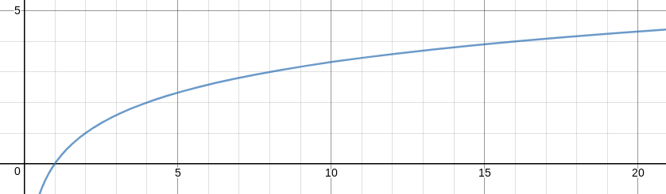

# 
Projet Unity

 

  Groupe 30:  
  Seleshi Mahelet, Bachelor GSEM 
  Poggio Enzo, Master Informatique pour sciences humaines  
  Mail: [Mahelet.Seleshi,Enzo.Poggio]@etu.unige.ch  
  GithuB: [https://github.com/EPgg92/stm](https://github.com/EPgg92/stm)

## Notre proposition

Pour répondre aux exigences des consignes, nous souhaitons réaliser un Rogue-Like 2D avec le moteur de jeu Unity qui sera destiné à apprendre à additionné des chiffres (1 à 9). Nous adressons donc notre jeu à des enfants devant apprendre à calculer rapidement.

### But du jeu

Notre je prends place dans un univers post-apocalyptique où apparemment notre protagoniste est chassé par des Zombies. Pour aider à leur échapper le joueurs doit faire l'addition des deux tuiles spéciales sur la grille pour trouver la bonne sortie; puis trouver le chemin vers la bonne sortie qui évite au plus les Zombies et qui permet de ramasser le plus de nourriture.

### Gameplay

La nourriture sera notre vie. On commence une partie avec un capital de 100 de nourriture. On peut en perdre en se faisant attaquer par les zombies (-10 ou -20) ou bien en se déplaçant (-1) ou bien encore en prenant une mauvaise sortie (int(food/2) + 1). Le joueur pourra regagner de la vie s'il ramasse certain pick up: des sodas (+20) ou des pommes (+10). Certaines mauvaises sorties seront évidentes car rouge et sans nombre dessus.

Si le protagoniste n'a plus de nourriture il meurt et c'est la fin du jeu. La partie est perdue. Au bout d'un certain nombre de niveau (une vingtaine) le jeux se finira. La partie est gagnée! Les niveaux seront exprimés en nombre de jour où le protagoniste a survécu.

Ce rogue est un tour par tour, c'est-à-dire que tant que vous n'effectuez pas votre action les ennemies n'effectue pas la leur. Le joueur à deux types d'action: se déplacer dans une direction cardinal et casser un mur qui gène le passage.

### Nos règles d’adaptivité

La difficulté sera progressive est constante elle se base uniquement sur le nombre d'ennemies qui vont spawn au début de chaque salle.

 
**Courbe d'augmentation du nombre d’ennemies**

Ainsi on aura 1 ennemie à partir du niveau 2, puis 2 à partir du niveau 4, puis 3 à partir du niveau 8, et finalement 4 à partir du niveau 16.

Si il nous reste du temps nous ferons un adaptation de la difficulté dans le calcul aussi. C'est à dire plus on va dans des niveaux élevé plus les chiffres sont grands. Et plus les mauvaises sorties auront des résultats proches de la bonne.

### Structure du jeu prévue

#### Scène

Nous n'aurons qu'une scène dans notre jeu où le plateau de déplacement ne sera que de 8 par 8 (avec les bordure infranchissable 10 par 10).
À chaque nouvelle partie et nouveau niveau le plateau sera totalement régénéré aléatoirement.

#### Gameobjects

  Tous nos gameobjects seront sauvés en temps que prefabs:

-   **Player** : prefabs du sprite du protagoniste contrôlé par le joueur.
-   **Enemy** : 2 prefabs pour 2 sprites d'ennemies différents.
-   **Exit** : 24 prefabs de sortie une mentionnant juste "Exit" pour la fin du jeu; 17 sorties numérotés de 2 à 18 pour les calculs; 6 sorties en rouge piège.
-   **Floor** : 8 prefabs pour 8 sprites de sols différents.
-   **SpcialFloor** : 9 prefabs pour 9 sprites de sols numérotés de 1 à 9.
-   **Food** : prefabs du pick up avec le sprite de pommes.
-   **Soda** :prefabs du pick up avec le sprite de sodas.
-   **Wall** : 8 prefabs pour 8 sprites de murs différents.
-   **OuterWall** : 3 prefabs pour 3 sprites de murs extérieurs différents.

#### Scripts

-   **GameManager**: Permet d'initialiser les différentes instances du jeu.
-   **BoardManager**: Permet de créer le plateaux de déplacement.
-   **SoundManager**: Permet d’exécuter les interactions sonores du jeu.
-   **Loader**: Empêche de créer une nouvelle instance du jeux, en crée une si nécessaire.
-   **MovingObject**: Permet de définir comment vont bouger nos Units (Player et Enemy).
-   **Enemy**: Définit les différentes actions des ennemies.
-   **Player**: Définit les différentes actions du jouer.
-   **Wall**: Permet de gérer la destruction d'un mur par le joueur.

### Ressources utilisés

Nous allons utiliser un assortiment d'assets et de tutoriels proposés sur l'Asset Store de unity:

-   [2D Roguelike tutorial](https://unity3d.com/fr/learn/tutorials/s/2d-roguelike-tutorial)
-   [Tutoriels Vidéos](https://www.youtube.com/watch?v=Fdcnt2-Jf4w&list=PLX2vGYjWbI0SKsNH5Rkpxvxr1dPE0Lw8F)

## ToDo:

| What to do ?                                               | Who done this ? | When was it done ? | Remarques                                                  |
| ---------------------------------------------------------- | :-------------: | :----------------: | ---------------------------------------------------------- |
| [Project Introduction](https://youtu.be/Fdcnt2-Jf4w)       |       Enzo      |     2018.04.12     | Il suffit de télécharger le repo github pour y avoir accès |
| [Animations](https://youtu.be/mmyr2l9dxoU)                 |       Enzo      |     2018.04.12     | RAS                                                        |
| [Tile Prefabs](https://youtu.be/3xqUo--8d0s)               |                 |                    |                                                            |
| [Board Manager](https://youtu.be/bvvaqAbpPjc)              |                 |                    |                                                            |
| [Game Manager](https://youtu.be/7NYXBUWmFvU)               |                 |                    |                                                            |
| [Moving Objects](https://youtu.be/fURWEzpNPL8)             |                 |                    |                                                            |
| [Walls](https://youtu.be/MEA4Qqpcwpg)                      |                 |                    |                                                            |
| [Player Animator Controller](https://youtu.be/iT8TSgPAykI) |                 |                    |                                                            |
| [Player Script](https://youtu.be/zyX3hxtblKY)              |                 |                    |                                                            |
| [Enemy Script](https://youtu.be/C6G8ra9ncwA)               |                 |                    |                                                            |
| [Enemy Animator Controller](https://youtu.be/36D2pACY0XI)  |                 |                    |                                                            |
| [UI & Levels](https://youtu.be/FIa7qxGaRZo)                |                 |                    |                                                            |
| [Audio](https://youtu.be/n7cdYMSlVxA)                      |                 |                    |                                                            |
| [Mobile Controls](https://youtu.be/YaL4JlUwOww)            |                 |                    |                                                            |

### Special Todo:

| What to do ?                                             | Who done this ? | When was it done ? | Remarques                                                               |
| -------------------------------------------------------- | :-------------: | :----------------: | ----------------------------------------------------------------------- |
| Créer des nouveaux sprits pour les additions             |       Enzo      |     2018.04.12     | _ Les couleurs sont bizarres il faut revoir comment l'image est sauvé _ |
| Ajouter des tuiles spéciales de nombres (floor, prefabs) |                 |                    |                                                                         |
| Ajouter des tuiles spéciales de nombres (exit, prefabs)  |                 |                    |                                                                         |
| Créer script pour additions                              |                 |                    |                                                                         |
| Ajouter nos tuiles spéciales à la grille de jeu (script) |                 |                    |                                                                         |
| Connaître nos tuiles spéciales sur la grille (script)    |                 |                    |                                                                         |
| ... _ truc manquant à venir _                            |                 |                    |                                                                         |
